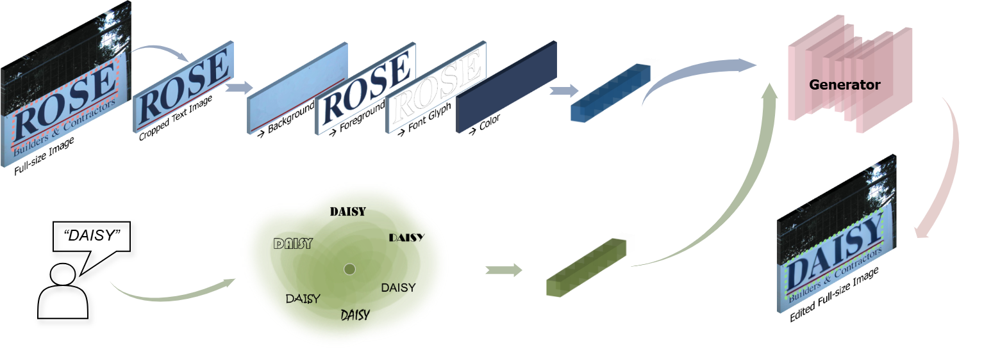

# TextCtrl: Diffusion-based Scene Text Editing with Prior Guidance Control
Pytorch implementation of [TextCtrl: Diffusion-based Scene Text Editing with Prior Guidance Control](https://arxiv.org/abs/2410.10133).

<a href='https://arxiv.org/abs/2410.10133'></a> <a href='https://github.com/weichaozeng/TextCtrl'></a>


## TODOs
- [x] Release ScenePair benchmark dataset and evaluation code;
- [x] Release the model and inference code;
- [ ] Release checkpoints and training code;
- [ ] Provide publicly accessible demo link;


## 1 Installation
### 1.1 Code Preparation 
```bash
# Clone the repo
$ git clone https://github.com/weichaozeng/TextCtrl.git
$ cd TextCtrl/
# Install required packages
$ conda create --name textctrl python=3.8
$ conda activate textctrl
$ pip install torch==1.13.0+cu116 torchvision==0.14.0+cu116 torchaudio==0.13.0 --extra-index-url https://download.pytorch.org/whl/cu116
$ pip install -r requirement.txt
```
### 1.2 Checkpoints Preparation
Download the checkpoints from [Link_1](still preparing) and [Link_2](https://huggingface.co/stable-diffusion-v1-5/stable-diffusion-v1-5).The file structure should be set as follows:
```bash
TextCtrl/
├── weights/
│   ├── model.pth                      # weight of style encoder and unet 
│   ├── text_encoder.pth               # weight of glyph encoder
│   ├── vision_model.pth               # monitor weight
│   ├── ocr_model.pth                  # ocr weight
│   ├── vgg19.pth                      # vgg weight
│   └── sd/                            # pretrained weight of stable-diffusion-v1-5
│       ├── vae/
│       ├── unet/
│       └── scheduler/ 
├── README.md
├── ...
```
## 2 Inference
### 2.1 Data Preparation
The file structure of inference data should be set as the *example/*:  
```bash
TextCtrl/
├── example/
│   ├── i_s/                # source cropped text images
│   ├── i_s.txt             # filename and text label of source images in i_s/
│   └── i_t.txt             # filename and text label of target images
```

### 2.2 Generate Images
The inference result could be found in *example_result/* after:
```bash
$ PYTHONPATH=.../TextCtrl/ python inference.py
```


## 3 Training

## 4 Evaluation
### 4.1 Data Preparation
Download the ScenePair dataset from [Link](https://drive.google.com/file/d/1m_o2R2kFj_hDXJP5K21aC7lKs-eUky9s/view?usp=sharing) and unzip the files. The structure of each folder is as follows:  
```bash
├── ScenePair/
│   ├── i_s/                # source cropped text images
│   ├── t_f/                # target cropped text images
│   ├── i_full/             # full-size images
│   ├── i_s.txt             # filename and text label of images in i_s/
│   ├── i_t.txt             # filename and text label of images in t_f/
│   ├── i_s_full.txt        # filename, text label, corresponding full-size image name and location information of images in i_s/
│   └── i_t_full.txt        # filename, text label, corresponding full-size image name and location information of images in t_f/
```
### 4.2 Generate Images
Before evaluation, corresponding edited images should be generated for a certain method based on the ScenePair dataset and should be saved in a *'.../result_folder/'* with the same filename. Result of some methods on ScenePair dataset are provided [here](https://drive.google.com/file/d/1343td96X7SuE0hYsMbTHALFmr1Md7SnQ/view?usp=drive_link).

### 4.3 Style Fidelity
SSIM, PSNR, MSE and FID are uesd to evaluate the style fidelity of edited result, with reference to [qqqyd/MOSTEL](https://github.com/qqqyd/MOSTEL)
.
```bash
$ cd evaluation/
$ python evaluation.py --target_path .../result_folder/ --gt_path .../ScenePair/t_f/
```

### 4.4 Text Accuracy
ACC and NED are used to evaluate the text accuracy of edited result, with the offical code and checkpoint in [clovaai/deep-text-recognition-benchmark](https://github.com/clovaai/deep-text-recognition-benchmark).  

## Related Resources
Many thanks to these great projects [lksshw/SRNet](https://github.com/lksshw/SRNet)
, [youdao-ai/SRNet-Datagen](https://github.com/youdao-ai/SRNet-Datagen)
, [qqqyd/MOSTEL](https://github.com/qqqyd/MOSTEL)
, [UCSB-NLP-Chang/DiffSTE](https://github.com/UCSB-NLP-Chang/DiffSTE)
, [ZYM-PKU/UDiffText](https://github.com/ZYM-PKU/UDiffText)
, [TencentARC/MasaCtrl](https://github.com/TencentARC/MasaCtrl)
, [unilm/textdiffuser](https://github.com/microsoft/unilm/tree/master/textdiffuser)
, [tyxsspa/AnyText](https://github.com/tyxsspa/AnyText).

## Citation
    @article{zeng2024textctrl,
    title={TextCtrl: Diffusion-based Scene Text Editing with Prior Guidance Control},
    author={Zeng, Weichao and Shu, Yan and Li, Zhenhang and Yang, Dongbao and Zhou, Yu},
    journal={arXiv preprint arXiv:2410.10133},
    year={2024}
    }
